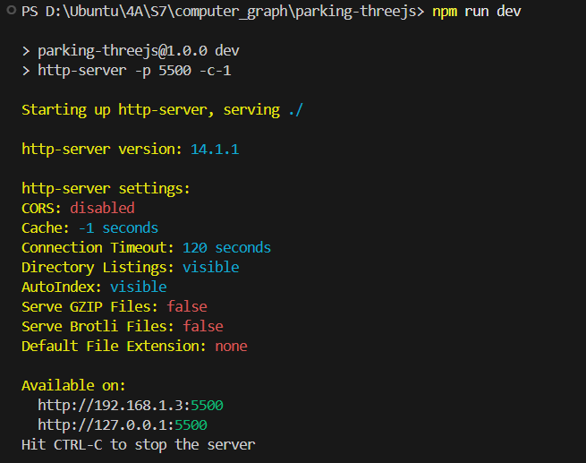

# Three.js Parking Lot – Teknik Informatika Project
📌 Final Project – Computer Graphics
🧑‍💻 Author: 
- Gharbi Yassine (ENISSAY39)
- Gharbi Yassine
- Safwane Mkhinini
- Abderrahmane Fajli
- Naman Kumar (garginternationalco-dot)
- Yanis Falahy

🏫 **Institut Teknologi Sepuluh Nopember (ITS)**

---

## 🚗 Project Overview

This project is a **3D interactive visualization** of the Teknik Informatika parking lot, built using **Three.js**.  
It features procedural materials, realistic lighting, a metal-roof parking shelter, environment objects, trees, cars, and more.

The goal is to demonstrate **core computer graphics concepts** using WebGL & JavaScript.

---

## ✨ Features

- ✔ Procedural brick texture for the building  
- ✔ Procedural paver texture for the ground  
- ✔ Procedural sky with clouds (CanvasTexture)  
- ✔ Metal lamella roof structure (parking shelter)  
- ✔ Auto-generated parking slot markings  
- ✔ Low-poly cars  
- ✔ Trees & environmental props  
- ✔ Curb sections (yellow/black alternating)  
- ✔ Speed bump (ExtrudeGeometry)  
- ✔ OrbitControls camera interaction  
- ✔ Real-time shadows (DirectionalLight + AmbientLight)

---

## ▶️ How to Run the Project

1. Install dependencies : 
```bash
npm instal
```

2. If using Windows PowerShell & scripts are blocked :
```bash
Set-ExecutionPolicy -Scope CurrentUser -ExecutionPolicy RemoteSigned
```

3. Start development server : 
```bash
npm run dev
```
4. The project will open at:

# 

---

## 🖼️ Preview

## 🖼️ Preview


## 📦 Technologies Used


- **Three.js**
- **JavaScript (ES Modules)**
- **CanvasTexture / WebGL**
- **Vite / NPM**


